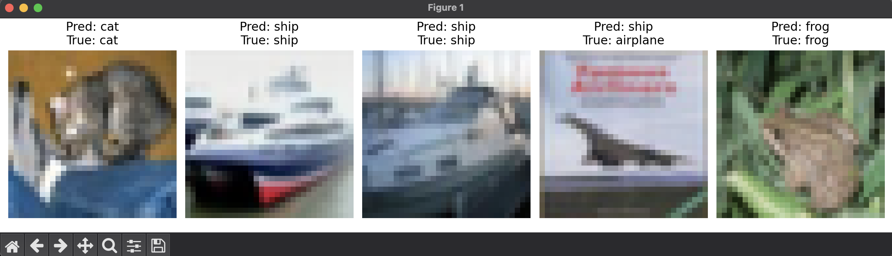
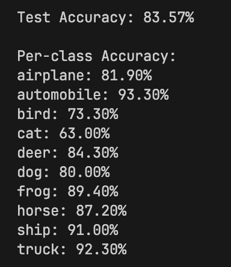

# CIFAR-10 Image Classification using Convolutional Neural Networks
## Project Overview
This project implements an image classification model using Convolutional Neural Networks (CNNs) to classify images from the CIFAR-10 dataset. The model achieves an accuracy of 80% after training for 20 epochs.

## Table of Contents
- Dataset
- Model Architecture
- Requirements
- Installation
- Training
- Results

## Dataset
The CIFAR-10 dataset consists of 60,000 32x32 color images in 10 different classes:

- Airplane
- Automobile
- Bird
- Cat
- Deer
- Dog
- Frog
- Horse
- Ship
- Truck

Each class contains 6,000 images, with 50,000 training images and 10,000 test images

## Model Architecture
The CNN model consists of:

- Convolutional layers for feature extraction
- Max pooling layers for downsampling
- Fully connected layers for classification
- ReLU activation functions
- Batch normalization for improved training stability


## Requirements

- Python 3.8+
- PyTorch 1.10+
- torchvision
- matplotlib
- numpy
- seaborn
## Installation

To run this project, you need to install the following packages:

```python
pip install numpy
pip install pandas
pip install matplotlib
pip install torch torchvision torchaudio
pip install seaborn
pip install scikit-learn==3.5.0
```

## Training
Training parameters:

- Epochs: 20
- Batch Size: 64
- Learning Rate: 0.001
- Optimizer: Adam
- Loss Function: Cross-Entropy Loss

## Results

- Final Accuracy: 80%
- Training Time: Approximately 15-20 minutes (depends on hardware)
- Validation Accuracy: 78-82%
   
 
  
